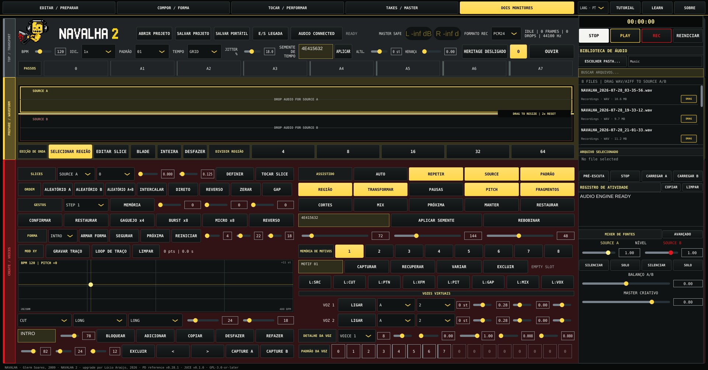

# Navalha 2 — JUCE/C++ migration

<p align="center">
  
  
</p>

<p align="center">
  
</p>

Contact: **rasgo.instruments@gmail.com**

Languages:

- [English](#english)
- [Português](#português)
- [Français](#français) (translation pending)
- [Español](#español) (translation pending)

---

## English

Current version of the JUCE migration: **v0.1.0**. The **v0.28.1** version
mentioned throughout this documentation is the functional Pure Data/web
reference used to measure parity; it is not the JUCE application's own
version number.

This tree is parallel to, and does not replace, the v0.28.1 application.
Since the split into two sibling directories inside `RASGO/`, the Pure
Data/web runtime app lives in `../NAVALHA2_PD/` (it used to be `../` from
here, back when this folder was still the `juce/` subfolder of a single
project).

The current runtime still lives at:

- `../NAVALHA2_PD/app/`
- `../NAVALHA2_PD/bridge/`
- `../NAVALHA2_PD/core/`
- `../NAVALHA2_PD/run_navalha.sh`

### State of this first stage

- initial C++ model for sources, slices and mixer;
- fixed bank of 10 × 8 patterns with SOURCE A/B/GAP cells;
- GRID sequencer by samples, with STOP invalidating pending work;
- stereo A/B DSP mixer with pan and mid/side width equivalent to the Pure
  Data patch;
- 15 ms linear ramps in the mixer path, with no per-sample allocation;
- immutable stereo buffers during playback and reading with linear
  interpolation;
- forward/reverse player with an adaptive 0.5–5 ms envelope and STOP with
  fade;
- `AudioEngine` authority linking the sequencer, banks A/B, players and
  mixer;
- two alternating voices per source for retrigger with a crossfade tail;
- JUCE shell wired to a real stereo output callback via `AudioAppComponent`;
- fixed SPSC queue for UI → audio commands, with no locks, waiting or
  allocation;
- structural gestures sent through the same UI → audio queue;
- slice banks in fixed storage, with contiguous BLADE and non-destructive
  undo;
- offline in-memory rendering with peak, energy and checksum for golden
  WAVs;
- Linux golden regression with DSP and full PCM24 WAV signatures;
- thirty-second combined golden stress test with JITTER, Assisted, FORM,
  TRACE, pitch and two virtual voices;
- safety ceiling of ten million samples per test render;
- GRID, FREE and JITTER clocks by samples, with a reproducible time seed;
- deterministic and reversible MEMORY, MUTATION, EROSION and DECONSTRUCT;
- sample-accurate STUTTER ×4 and BURST ×8 plans;
- fixed realtime scheduler to run STUTTER/BURST without allocation;
- MICRO ×2–8 with fixed capacity and per-slice reverse in the realtime
  queue;
- native JUCE controls for MEMORY, transformations, STUTTER, BURST, MICRO
  and REVERSE;
- FORM Director with five default scenes, up to 16 scenes, limits, lock
  and navigation;
- interoperable Project v2 persistence of FORM and TRACE XY (up to 512
  points);
- sample-accurate TRACE LOOP applying BPM and Heritage Pitch in the
  callback;
- FORM advancing by phrase, switching LONG/MEDIUM/SHORT/MICRO banks and
  modulating the Assisted Performer's context;
- complete native FORM editor with name, transition, A/B profiles, six
  dimensions, lock, add/copy/delete/move and 64-step structural undo/redo;
- explicit capture of named A/B banks, recall by scene and optional
  interoperable persistence in Project v2;
- scene names and history in pre-allocated storage, with no allocation in
  operations executed by the callback;
- MASTER stage 0–1 after the mixer, with 15 ms smoothing shared between
  realtime/offline;
- `liveSafe` profile in the app: non-finite sanitation, DC blocking and a
  stereo limiter with 5 ms lookahead and a -1 dBTP ceiling engaged after
  summing the instrument with Library Preview;
- `legacy` profile preserved in the core for parity comparison; the
  liveSafe limiter already contains the EBU 19–23 cases synthesized from
  the spec, but the official WAVs are still needed before a general true
  peak conformance declaration; independent FFmpeg measurement already
  passed;
- `MASTER CREATIVE` stays in the instrument's own domain; the technical
  `OUTPUT TRIM` attenuates from -24 to 0 dB before the limiter and is
  persisted as a local preference;
- technical MUTE with a 10 ms ramp and a reconnect lifecycle with atomic
  suspension, silent resume and fade-in, without touching Project state;
- two virtual voices with source, division, pattern, focus, pitch,
  envelope, level and pan;
- automatic voice headroom compatible with the one/two-voice reference;
- Heritage Pitch with two heads, four-point `vd~`-style interpolation,
  cosine windows and a 5 Hz high-pass;
- 20 ms dry/processed crossfade compatible with the Pure Data stage;
- Project v2 snapshots and Project v1 migration, preserving deterministic
  state;
- lock-free post-MASTER stereo recording FIFO, with overflow accounted
  for;
- streaming WAV RIFF encoder for PCM 16, PCM 24 and float 32;
- deterministic TPDF dither by default on PCM16/PCM24, never on float32,
  with a configurable seed and final sanitation of non-finite samples;
- portable-pack path validation against traversal and absolute paths;
- WAV writer on a separate thread, with a stop handshake and FIFO
  draining;
- atomic REC publication: the temporary WAV only becomes final after a
  valid RIFF;
- persistent TAKE v1 catalog for newly finished WAVs;
- TAKE Timeline window with private metadata, review and pre-REC recipe;
- non-destructive return of a TAKE to SOURCE A/B;
- preventive REC limit by free space, one hour and a 4 GiB RIFF ceiling;
- minimum 1 GiB reserve on the destination volume during recording;
- in-memory WAV decoder for PCM 16/24 and float 32, mono or stereo;
- PCM24 decoder also compatible with `WAVE_FORMAT_EXTENSIBLE`;
- stereo min/max waveform cache with resolution capped at 8192 bins;
- MASTER metrics compatible with the v0.28.1 estimate, with a read limit;
- frame-based ALBUM MASTER planning for trims, fades and gaps;
- safe codec for the `navalha-album-master` v1 manifest and linear
  envelopes;
- initial C++ TRACK MASTER chain with EQ, dynamics, saturation, width and
  ceiling;
- codec for the `navalha-master-recipe` v1 recipe, compatible with the web
  interface;
- golden regression specific to detecting changes in the TRACK MASTER
  chain;
- objective WebAudio/C++ comparison over 353,708 frames within 0.25 dB;
- RIFF LIST/INFO metadata for title, artist, project, year and comment;
- optional later RIFF writing in the TAKE Timeline, with confirmation,
  validated partial, smart-link/copy backup and recoverable replacement;
- Assisted Performer Mulberry32 RNG identical to the JavaScript one, with
  seed/cursor;
- Assisted planner by phrase with timing, transformations, pitch and
  fragments;
- Assisted decisions for source, pattern, region, cuts and AUTO MIX;
- pattern recombination with reverse/interleave/mutation, MEMORY and safe
  GAP;
- automatic slice edits limited to nudge, micro, blade, undo and redivide;
- conservative AUTO MIX restricted to balance, pan and width;
- probabilities, limits and FORM/energy mapping equivalent to v0.28.1;
- realtime Assisted execution when each phrase closes, with no interface
  timers;
- native AUTO, vocabulary, BPM range, variation and seed/rewind controls;
- internal JSON codec with size/depth limits for Project v1/v2;
- JSON mapping compatible with sources, sequencer, DSP, timing and
  Assisted state;
- Project v2 also preserving Assisted settings/vocabulary;
- mixer automation interoperable with `dsp.sourceMixer.automation`;
- realtime telemetry of source, pattern, row, BPM, pitch and mixer for the
  shell;
- Project v2 preserving MEMORY, base and transformation intensities;
- portable pack ZIP store with CRC32, limits, deduplication and traversal
  protection;
- portable Navalha service restricted to project.navalha and SOURCE A/B
  audio;
- shell with LOAD A/B, waveform, PLAY/STOP, MASTER, project and WAV
  recording;
- native BPM/rate, pattern, GRID/FREE/JITTER and Heritage Pitch controls;
- editable JITTER intensity and reproducible seed in the shell;
- eight-step editor with A0–A127, B0–B127 and GAP codes;
- native A/B mixer with persistent level, pan, width, mute and solo;
- persistent global A/B balance, smoothed by the realtime mixer;
- native slice editor with SOURCE A/B, START/END, division, BLADE and
  undo;
- slice bounds and indices drawn over the waveform;
- controls for the two virtual voices' enable, source, division, pitch,
  level and pan;
- virtual voice detail with a 16-step pattern, length, focus and envelope;
- shell content in a scrollable viewport for smaller screens;
- UI → audio queue sync before capturing project snapshots;
- v2 audio references with filename, relativePath, size, date and MIME;
- safe reload of relative WAVs when opening lightweight `.navalha`
  projects;
- Linux guard to exit cleanly when no X11 display is reachable;
- stereo meters, device and recording all receive the same post-safety
  signal, including while Library Preview is active, plus recording
  frame/drop telemetry;
- meters show sample peak in dBFS; additional telemetry publishes
  per-block RMS, input peak, gain reduction, non-finites and ceiling
  engagement, with a two-second visual safety hold;
- polyphase 4× FIR true-peak detector in the live stream, initially
  validated by EBU Tech 3341 cases 15–23 (20–23 being derived fixtures);
  it drives a 5 ms-lookahead limiter, with no allocation in the callback,
  with latency explicitly published by the engine;
- live worst-sum test with Sources A/B at maximum, two virtual voices,
  master at 100% and simultaneous Library Preview, requiring finite output
  and a true-peak ceiling after the limiter;
- optional CTest cross-validation with FFmpeg's `ebur128`: input cases
  15–23 and post-limiter WAVs checked by an external implementation;
- limiter impulse and latency contracts at 44.1, 96 and 192 kHz, plus a
  clean stage reset after a sample-rate change;
- atomic PLAY/STOP, step and generation telemetry for the interface;
- realtime highlight of the next step with no concurrent SessionModel
  read;
- lock-free A/B playhead derived from the main players, with a cursor and
  current/duration readout on both waveforms, including in reverse;
- selectable PCM16, PCM24 or float32 recording with drop diagnostics;
- TAKE Timeline with recursive/deduplicated import of prior WAVs and
  reading of available RIFF metadata;
- private metadata preset derived from any take and applied only to future
  recordings;
- persistent ALBUM PROJECT with take selection, deduplication, editorial
  order, v1 export and direct render through ALBUM MASTER;
- ORIGINAL/MASTER TRACK MASTER comparison via aligned float32 temporaries,
  with compensation that only attenuates the louder side and locks during
  REC;
- relative ALBUM PROJECT matching to an estimated target, capped at ±6 dB,
  with persistent per-track analysis/trim;
- native JUCE panel for device, stereo output, buffer and sample rate;
- device configuration persisted in local app preferences;
- invariants compatible with Project v2;
- tests that need neither JUCE nor an audio device;
- standalone shell built with JUCE 8.0.13 on Linux;
- no JUCE copy vendored into the repository;
- no file from the current implementation removed or renamed.

### Quick test without CMake/JUCE

```sh
./test_core.sh
```

The script builds only the core with the system compiler, runs the
contracts and places the temporary binary outside the source tree.

The full CTest suite also verifies that the application refuses headless
execution cleanly, without a segmentation fault.

### Build with CMake

Requirements:

- CMake 3.22 or later;
- a C++20 compiler;
- JUCE configured externally.

```sh
cmake -S . -B build/juce -DCMAKE_BUILD_TYPE=Debug
cmake --build build/juce
ctest --test-dir build/juce --output-on-failure
```

With a local, non-installed JUCE checkout:

```sh
cmake -S . -B build/juce \
  -DNAVALHA_JUCE_PATH=/path/to/JUCE \
  -DNAVALHA_PD_PATH=/path/to/navalha2-pd \
  -DCMAKE_BUILD_TYPE=Debug
```

The WebView is off in the initial native shell to reduce dependencies:

```sh
cmake -S . -B build/juce \
  -DNAVALHA_JUCE_PATH=/path/to/JUCE \
  -DNAVALHA_PD_PATH=/path/to/navalha2-pd \
  -DNAVALHA_ENABLE_WEBVIEW=OFF
```

In this workspace, after preparing local dependencies, the two-process-
limited build and the tests can be repeated with:

```sh
./build_local.sh
```

`NAVALHA_JOBS` lets you change the parallelism limit explicitly.

#### Multiplatform packages (Linux/Windows/macOS)

Build and packaging (`.deb` via CPack/DEB on Linux, `.exe` via NSIS on
Windows, `.dmg` via DragNDrop on macOS) run on GitHub's own hosted
runners — no Windows or macOS machine is needed to build these. Open
**Actions** on GitHub and run the **Package (Linux/Windows/macOS)**
workflow (`.github/workflows/package.yml`); it also runs automatically on
any `v*` tag push. Each platform's installer is uploaded as a workflow
artifact, downloadable from the run page by anyone with access to the
repository.

The locally-generated Linux package reflects the build machine's own
library versions. For the most compatible internal `.deb`, use the same
CI workflow above (fixed to Ubuntu 22.04 and JUCE 8.0.13).

Instructions for whoever installs the artifact are in
[`docs/INSTALACAO_DEB_INTERNA.md`](docs/INSTALACAO_DEB_INTERNA.md).
Minimum requirements are in
[`docs/REQUISITOS_MINIMOS_LINUX.md`](docs/REQUISITOS_MINIMOS_LINUX.md).

### WAV comparison

The build also produces `navalha_compare_wav`, used to compare a Pure Data
reference render against the JUCE output. The files need the same sample
rate and frame count:

```sh
.local-build/juce-app-native/navalha_compare_wav \
  reference.wav juce-candidate.wav
```

The JSON output contains the reference RMS, the difference's RMS and
peak, correlation and SNR. Reading is capped at 512 MiB per file and does
not create disk copies. A known candidate latency can be compensated
without copying the audio:

```sh
.local-build/juce-app-native/navalha_compare_wav \
  reference.wav juce-candidate.wav --candidate-offset 480
```

A positive offset skips leading candidate frames; negative skips leading
reference frames.

### MASTER analysis

> The analysis and TRACK MASTER below preserve the historical migration
> flow. They do not yet constitute the common safe-output layer defined
> for the RASGO instruments. See `docs/AUDITORIA_ENGENHARIA_SAIDA_AUDIO.md`
> before classifying the result as a stage ceiling or a final master.

The C++ analyzer reads a WAV without altering the original and reports
peak, RMS, estimated LUFS, crest, correlation and headroom:

```sh
.local-build/juce-app-native/navalha_analyze_master mix.wav
```

Input is capped at 512 MiB. As in v0.28.1, LUFS is an internal estimate,
not a certified EBU R128/ITU-R BS.1770 measurement.

The TRACK MASTER renderer applies v0.28.1's default parameters and
publishes a PCM24 with TPDF dither atomically, never overwriting files:

```sh
.local-build/juce-app-native/navalha_render_master \
  mix.wav mix_MASTER.wav [recipe.master.json]
```

This chain is already deterministic and testable, but still requires
objective and auditory comparison against the WebAudio processing before
being considered a replacement.

The full quantization policy is in
[`docs/DITHER_TPDF.md`](docs/DITHER_TPDF.md). Float32 stays undithered;
fixtures that require non-dithered bytes must request that mode
explicitly.

Existing ALBUM MASTER manifests can be verified and planned without
rendering audio:

```sh
.local-build/juce-app-native/navalha_inspect_album \
  album_ALBUM_MASTER.json 48000
```

Inspection caps the manifest at 4 MiB and rejects more than 99 tracks,
traversal, out-of-range parameters and invalid numeric values.

The batch render processes the tracks associated with the manifest, one at
a time, and publishes each PCM24 through a partial file:

```sh
.local-build/juce-app-native/navalha_render_album \
  album_ALBUM_MASTER.json existing-output-folder
```

All inputs are decoded before the first publication. The command refuses
overwrites, preserves 1 GiB free on the volume and caps each WAV at
512 MiB.

### Offline render of portable projects

A portable project can be rendered without an interface or audio device:

```sh
.local-build/juce-app-native/navalha_render_portable \
  project.zip juce-candidate.wav 30 48000
```

Duration is capped at ten minutes. The render uses small blocks, refuses
to overwrite files and writes first to `.partial`; a failure removes only
that temporary file. On completion, it reports frames, peak, RMS and
checksum.

The portable ZIP → Project v2 → WAV decoder → engine → PCM24 path was
validated with 12,000 frames at 48 kHz and inspected with `ffprobe`. The
temporary artifacts from that validation are removed on completion.

If the JUCE package is not found, the core and its tests can still be
configured with:

```sh
cmake -S . -B build/juce -DNAVALHA_BUILD_JUCE_APP=OFF
```

The core's contracts can also be run under AddressSanitizer and
UndefinedBehaviorSanitizer without creating a persistent build:

```sh
ASAN_OPTIONS=detect_leaks=0 NAVALHA_SANITIZE=1 ./test_core.sh
```

After the build, the combined stress test accepts a virtual duration
between one second and one hour. It compares 64- and 511-frame buffers
exactly, without recording audio:

```sh
.local-build/juce-app-native/navalha_engine_stress_tests --seconds 600
```

The ten-minute scenario passed with Assisted, FORM, TRACE, Heritage
Pitch, mixer and virtual voices all active.

A real v1/v2 project can be validated with no interface, no audio and no
modification to it. The report states the input version and the
canonical v2 form:

```sh
.local-build/juce-app-native/navalha_inspect_project project.json
```

The writer can be exercised without a physical device, using a temporary
PCM24, backpressure and automatic cleanup. Duration is capped at ten
minutes:

```sh
.local-build/juce-app-native/navalha_recording_soak_tests --seconds 60
```

The 60-second run published and reopened 2,880,000 frames with zero
drops; its ~17 MB temporary WAV was removed on completion.

`detect_leaks=0` is needed in the current supervised environment because
LeakSanitizer is incompatible with `ptrace`; this should not be read as an
approval of the absence of leaks. The remaining human trials are in
`docs/FINAL_ACCEPTANCE_CHECKLIST.md`.

### Boundaries

- The first product is standalone.
- The web interface will only be embedded via WebView during the
  transition phase.
- A single `SessionModel` will serve main, PERFORM and MASTER.
- On two suitable screens, PERFORM occupies the second monitor and the
  main window distributes editing/production without a scrollbar; smaller
  screens keep scrolling and the mouse wheel.
- The `TAKES / MASTER` workspace stays supplementary to the realtime
  engine; on wide screens it brings take review and mastering side by
  side.
- The native header offers LANG (EN/PT/FR/ES), a ten-chapter tutorial,
  contextual LEARN in the fixed log panel, and ABOUT in the top-right
  corner.
- The web shell's VIEW zoom was not kept: system DPI, resizing, dual
  layout and scrollbar make up the native behavior instead.
- Languages and help are a partial transposition: the tutorial/LEARN are
  in four languages, but not every instrument label is translated yet.
- v0.28.1 remains the reference until parity is approved.
- **Resolved**: GPLv3 Section 13 allows combining the Navalha 2 part under
  GPL-3.0-or-later with JUCE 8 under AGPL-3.0-only, with no commercial
  license. Each part keeps its own license, and the AGPLv3's network-
  interaction requirement applies to the combination. Full detail in
  `docs/LICENSE_STATUS.md` and `LICENSE-AGPLv3.txt`.

See also:

- `../NAVALHA2_PD/ANALISE_MIGRACAO_JUCE_CPP.txt`
- `../NAVALHA2_PD/docs/VIABILIDADE_JUCE_CPP.md`
- `docs/PARIDADE_V0281.md`
- `docs/LICENSE_STATUS.md`

---

## Português

# Navalha 2 — migração JUCE/C++

<p align="center">
  
  
</p>

<p align="center">
  
</p>

Contato: **rasgo.instruments@gmail.com**

Versão atual da migração JUCE: **v0.1.0**. A versão **v0.28.1** mencionada
nesta documentação é a referência funcional Pure Data/web usada para medir
paridade; não é o número de versão do aplicativo JUCE.

Esta árvore é paralela e não substitui a aplicação v0.28.1. Desde a
separação em dois diretórios irmãos dentro de `RASGO/`, o runtime Pure
Data/web app vive em `../NAVALHA2_PD/` (antes era `../` a partir daqui,
quando esta pasta ainda era a subpasta `juce/` dentro do projeto único).

O runtime atual continua em:

- `../NAVALHA2_PD/app/`
- `../NAVALHA2_PD/bridge/`
- `../NAVALHA2_PD/core/`
- `../NAVALHA2_PD/run_navalha.sh`

### Estado desta primeira etapa

- modelo C++ inicial para fontes, slices e mixer;
- banco fixo de 10 × 8 padrões com células SOURCE A/B/GAP;
- sequenciador GRID por amostras, com STOP invalidando trabalho pendente;
- mixer DSP estéreo A/B com pan e mid/side width equivalentes ao patch Pure Data;
- rampas lineares de 15 ms no caminho do mixer, sem alocação por amostra;
- buffers estéreo imutáveis durante playback e leitura com interpolação linear;
- player normal/reverse com envelope adaptativo de 0,5–5 ms e STOP com fade;
- autoridade `AudioEngine` ligando sequencer, bancos A/B, players e mixer;
- duas vozes alternadas por source para retrigger com cauda de crossfade;
- shell JUCE ligado a um callback de saída estéreo real via `AudioAppComponent`;
- fila SPSC fixa para comandos UI → áudio, sem locks, espera ou alocação;
- gestos estruturais enviados pela mesma fila UI → áudio;
- bancos de slices em armazenamento fixo, com BLADE contíguo e undo não destrutivo;
- renderização offline em memória com peak, energia e checksum para WAVs dourados;
- regressão dourada Linux com assinaturas do DSP e do WAV PCM24 completo;
- stress dourado combinado de trinta segundos com JITTER, Assisted, FORM,
  TRACE, pitch e duas virtual voices;
- teto de segurança de 10 milhões de amostras por render de teste;
- relógios GRID, FREE e JITTER por amostras, com seed temporal reproduzível;
- MEMORY, MUTATION, EROSION e DECONSTRUCT determinísticos e reversíveis;
- planos sample-accurate de STUTTER ×4 e BURST ×8;
- scheduler realtime fixo para executar STUTTER/BURST sem alocação;
- MICRO ×2–8 com capacidade fixa e reverse por slice na fila realtime;
- controles JUCE nativos para MEMORY, transformações, STUTTER, BURST, MICRO e REVERSE;
- FORM Director com cinco cenas padrão, até 16 cenas, limites, lock e navegação;
- persistência Project v2 interoperável de FORM e TRACE XY (até 512 pontos);
- TRACE LOOP sample-accurate aplicando BPM e Heritage Pitch no callback;
- FORM avançando por frases, trocando bancos LONG/MEDIUM/SHORT/MICRO e
  modulando o contexto do Assisted Performer;
- editor FORM nativo completo com nome, transição, perfis A/B, seis dimensões,
  lock, add/copy/delete/move e undo/redo estrutural de 64 passos;
- captura explícita dos bancos nomeados A/B, recall por cena e persistência
  opcional interoperável no Project v2;
- nomes e histórico de cenas em armazenamento pré-alocado, sem alocação nas
  operações executadas pelo callback;
- estágio MASTER 0–1 após o mixer, com smoothing de 15 ms compartilhado por realtime/offline;
- perfil `liveSafe` no app: saneamento de não-finitos, bloqueio DC e limiter
  estéreo ligado com lookahead de 5 ms e teto de -1 dBTP depois da soma do
  instrumento com Library Preview;
- perfil `legacy` preservado no core para comparação de paridade; o limiter
  liveSafe já contém os casos EBU 19–23 sintetizados da especificação, mas os
  WAV oficiais ainda são necessários antes da declaração geral de conformidade
  true peak; a medição independente FFmpeg já passou;
- `MASTER CREATIVE` permanece no domínio do instrumento; `OUTPUT TRIM` técnico
  atenua de -24 a 0 dB antes do limiter e é persistido como preferência local;
- MUTE técnico com rampa de 10 ms e lifecycle de reconnect com suspensão
  atômica, retomada em silêncio e fade-in, sem tocar no estado do Project;
- duas virtual voices com source, divisão, pattern, foco, pitch, envelope, level e pan;
- headroom automático das vozes compatível com a referência de uma/duas vozes;
- Heritage Pitch com duas cabeças, interpolação `vd~` de quatro pontos,
  janelas cossenoidais e high-pass de 5 Hz;
- crossfade dry/processed de 20 ms compatível com o estágio Pure Data;
- snapshots Project v2 e migração Project v1, preservando estado determinístico;
- FIFO de gravação estéreo pós-MASTER sem locks, com overflow contabilizado;
- encoder WAV RIFF em stream para PCM 16, PCM 24 e float 32;
- dither TPDF determinístico por padrão em PCM16/PCM24, nunca em float32, com
  seed configurável e saneamento final de amostras não finitas;
- validação de caminhos de portable packs contra traversal e caminhos absolutos;
- writer WAV em thread separada, com handshake de parada e drenagem da FIFO;
- publicação atômica de REC: WAV temporário só vira final após RIFF válido;
- catálogo TAKE v1 persistente para novos WAVs finalizados;
- janela TAKE Timeline com metadados privados, review e recipe pré-REC;
- retorno não destrutivo de TAKE para SOURCE A/B;
- limite preventivo de REC por espaço livre, uma hora e teto RIFF de 4 GiB;
- reserva mínima de 1 GiB no volume de destino durante a gravação;
- decoder WAV em memória para PCM 16/24 e float 32, mono ou estéreo;
- decoder PCM24 compatível também com `WAVE_FORMAT_EXTENSIBLE`;
- cache de waveform estéreo min/max com resolução limitada a 8192 bins;
- métricas MASTER compatíveis com a estimativa v0.28.1, com limite de leitura;
- planejamento ALBUM MASTER por frames para trims, fades e gaps;
- codec seguro do manifesto `navalha-album-master` v1 e envelopes lineares;
- cadeia TRACK MASTER C++ inicial com EQ, dinâmica, saturação, width e ceiling;
- codec da receita `navalha-master-recipe` v1 compatível com a interface web;
- regressão dourada específica para detectar alterações na cadeia TRACK MASTER;
- comparação objetiva WebAudio/C++ sobre 353.708 frames dentro de 0,25 dB;
- metadados RIFF LIST/INFO para título, artista, projeto, ano e comentário;
- escrita RIFF posterior opcional na TAKE Timeline, com confirmação, parcial
  validado, backup por link inteligente/cópia e substituição recuperável;
- RNG Mulberry32 do Assisted Performer idêntico ao JavaScript, com seed/cursor;
- planejador Assisted por frase com tempo, transformações, pitch e fragmentos;
- decisões Assisted de source, pattern, region, cuts e AUTO MIX;
- recombinação de patterns com reverse/interleave/mutation, MEMORY e GAP seguro;
- edições automáticas de slices limitadas a nudge, micro, blade, undo e redivide;
- AUTO MIX conservador restrito a balance, pan e width;
- probabilidades, limites e mapeamento FORM/energy equivalentes à v0.28.1;
- execução Assisted realtime ao fechar cada frase, sem timers da interface;
- controles nativos AUTO, vocabulário, faixa BPM, variation e seed/rewind;
- codec JSON interno com limites de tamanho/profundidade para Project v1/v2;
- mapeamento JSON compatível com sources, sequencer, DSP, timing e Assisted state;
- Project v2 preservando também configurações/vocabulário do Assisted;
- automação do mixer interoperável com `dsp.sourceMixer.automation`;
- telemetria realtime de source, pattern, row, BPM, pitch e mixer para o shell;
- Project v2 preservando MEMORY, base e intensidades das transformações;
- portable pack ZIP store com CRC32, limites, deduplicação e proteção traversal;
- serviço portable Navalha restrito a project.navalha e áudio SOURCE A/B;
- shell com LOAD A/B, waveform, PLAY/STOP, MASTER, projeto e gravação WAV;
- controles nativos de BPM/rate, pattern, GRID/FREE/JITTER e Heritage Pitch;
- intensidade e seed reproduzível de JITTER editáveis no shell;
- editor dos oito passos com códigos A0–A127, B0–B127 e GAP;
- mixer nativo A/B com level, pan, width, mute e solo persistentes;
- balance global A/B persistente e suavizado pelo mixer realtime;
- editor nativo de slices com SOURCE A/B, START/END, divisão, BLADE e undo;
- limites e índices de slices desenhados sobre a waveform;
- controles das duas virtual voices para enable, source, divisão, pitch, level e pan;
- detalhe das virtual voices com pattern de 16 passos, comprimento, foco e envelope;
- conteúdo do shell em viewport rolável para telas menores;
- sincronização da fila UI → áudio antes de capturar snapshots de projeto;
- referências v2 de áudio com filename, relativePath, tamanho, data e MIME;
- recarga segura de WAVs relativos ao abrir projetos leves `.navalha`;
- guarda Linux para encerrar claramente quando nenhum display X11 está acessível;
- medidores estéreo, dispositivo e gravação recebem o mesmo sinal pós-safety,
  inclusive quando Library Preview está ativa, além da telemetria de
  frames/drops da gravação;
- medidores mostram sample peak em dBFS; a telemetria adicional publica RMS por
  bloco, pico de entrada, redução de ganho, não-finitos e atuação do ceiling,
  com retenção visual de segurança por dois segundos;
- detector true peak FIR polifásico 4× no fluxo ao vivo, validado inicialmente
  pelos casos 15–23 da EBU Tech 3341, sendo 20–23 fixtures derivadas; ele
  orienta um limiter lookahead de 5 ms, sem alocação no callback, com latência
  explicitamente publicada pelo motor;
- teste de pior soma ao vivo com Sources A/B no máximo, duas virtual voices,
  master em 100% e Library Preview simultânea, exigindo saída finita e teto
  true peak pós-limiter;
- validação cruzada opcional no CTest com FFmpeg `ebur128`: casos de entrada
  15–23 e WAVs pós-limiter verificados por implementação externa;
- contratos de impulso e latência do limiter em 44,1, 48, 96 e 192 kHz, além
  de reinicialização limpa do estágio após mudança de sample rate;
- telemetria atômica PLAY/STOP, passo e geração para a interface;
- destaque realtime do próximo passo sem leitura concorrente do SessionModel;
- playhead A/B lock-free derivado dos players principais, com cursor e
  readout atual/duração nas duas waveforms, inclusive em reverse;
- gravação selecionável em PCM16, PCM24 ou float32 com diagnóstico de drops;
- TAKE Timeline com importação recursiva/deduplicada de WAVs anteriores e
  leitura dos metadados RIFF disponíveis;
- preset privado de metadados derivado de qualquer take e aplicado somente às
  gravações futuras;
- ALBUM PROJECT persistente com seleção de takes, deduplicação, ordem editorial,
  exportação v1 e render direto pelo ALBUM MASTER;
- comparação TRACK MASTER ORIGINAL/MASTER por temporários float32 alinhados,
  com compensação que somente atenua o lado mais alto e bloqueio durante REC;
- matching relativo do ALBUM PROJECT para alvo estimado, limitado a ±6 dB,
  com análise/trim persistentes por faixa;
- painel JUCE de dispositivo, saída estéreo, buffer e sample rate;
- configuração do dispositivo persistida nas preferências locais do aplicativo;
- invariantes compatíveis com Project v2;
- testes que não precisam de JUCE nem dispositivo de áudio;
- shell standalone compilado com JUCE 8.0.13 no Linux;
- nenhuma cópia do JUCE incorporada ao repositório;
- nenhum arquivo da implementação atual removido ou renomeado.

### Teste imediato sem CMake/JUCE

```sh
./test_core.sh
```

O script compila somente o núcleo com o compilador do sistema, executa os
contratos e coloca o binário temporário fora da árvore de fontes.

O CTest completo também verifica que o aplicativo recusa execução headless de
forma limpa, sem segmentation fault.

### Build com CMake

Requisitos:

- CMake 3.22 ou superior;
- compilador com C++20;
- JUCE configurado externamente.

```sh
cmake -S . -B build/juce -DCMAKE_BUILD_TYPE=Debug
cmake --build build/juce
ctest --test-dir build/juce --output-on-failure
```

Com um checkout JUCE local não instalado:

```sh
cmake -S . -B build/juce \
  -DNAVALHA_JUCE_PATH=/caminho/para/JUCE \
  -DNAVALHA_PD_PATH=/caminho/para/navalha2-pd \
  -DCMAKE_BUILD_TYPE=Debug
```

O WebView fica desligado no shell nativo inicial para reduzir dependências:

```sh
cmake -S . -B build/juce \
  -DNAVALHA_JUCE_PATH=/caminho/para/JUCE \
  -DNAVALHA_PD_PATH=/caminho/para/navalha2-pd \
  -DNAVALHA_ENABLE_WEBVIEW=OFF
```

Neste workspace, depois de preparar as dependências locais, o build limitado a
dois processos e os testes podem ser repetidos com:

```sh
./build_local.sh
```

`NAVALHA_JOBS` permite alterar explicitamente o limite de paralelismo.

#### Pacotes multiplataforma (Linux/Windows/macOS)

Build e empacotamento (`.deb` via CPack/DEB no Linux, `.exe` via NSIS no
Windows, `.dmg` via DragNDrop no macOS) rodam nos runners hospedados pelo
próprio GitHub — não precisa de máquina Windows nem macOS pra gerar esses
builds. Abra **Actions** no GitHub e rode o workflow **Package (Linux/
Windows/macOS)** (`.github/workflows/package.yml`); ele também roda
automaticamente a cada push de tag `v*`. O instalador de cada plataforma é
disponibilizado como artefato do workflow, baixável pela página do run por
quem tem acesso ao repositório.

O pacote Debian gerado localmente reflete a versão das bibliotecas da
máquina de build. Para o `.deb` interno mais compatível, use o mesmo
workflow de CI acima (fixado em Ubuntu 22.04 e JUCE 8.0.13).

As instruções para a pessoa que irá instalar o artefacto estão em
[`docs/INSTALACAO_DEB_INTERNA.md`](docs/INSTALACAO_DEB_INTERNA.md).
Os requisitos mínimos estão em
[`docs/REQUISITOS_MINIMOS_LINUX.md`](docs/REQUISITOS_MINIMOS_LINUX.md).

### Comparação de WAVs

O build também gera `navalha_compare_wav`, usado para comparar uma renderização
da referência Pure Data com a saída JUCE. Os arquivos precisam ter a mesma taxa
e o mesmo número de frames:

```sh
.local-build/juce-app-native/navalha_compare_wav \
  referencia.wav candidato-juce.wav
```

A saída JSON contém RMS da referência, RMS e pico da diferença, correlação e
SNR. A leitura é limitada a 512 MiB por arquivo e não cria cópias no disco.
Uma latência conhecida do candidato pode ser compensada sem copiar o áudio:

```sh
.local-build/juce-app-native/navalha_compare_wav \
  referencia.wav candidato-juce.wav --candidate-offset 480
```

Offset positivo ignora frames iniciais do candidato; negativo ignora frames
iniciais da referência.

### Análise MASTER

> A análise e o TRACK MASTER abaixo preservam o fluxo histórico de migração.
> Eles ainda não constituem a camada comum de saída segura definida para os
> instrumentos RASGO. Ver `docs/AUDITORIA_ENGENHARIA_SAIDA_AUDIO.md` antes de
> classificar o resultado como ceiling de palco ou master final.

O analisador C++ lê um WAV sem alterar o original e informa peak, RMS, LUFS
estimado, crest, correlação e headroom:

```sh
.local-build/juce-app-native/navalha_analyze_master mix.wav
```

A entrada é limitada a 512 MiB. Assim como na v0.28.1, o LUFS é uma estimativa
interna e não uma medição certificada EBU R128/ITU-R BS.1770.

O renderizador TRACK MASTER aplica os parâmetros padrão da v0.28.1 e publica
um PCM24 com dither TPDF de forma atômica, sem sobrescrever arquivos:

```sh
.local-build/juce-app-native/navalha_render_master \
  mix.wav mix_MASTER.wav [receita.master.json]
```

Esta cadeia já é determinística e testável, mas ainda requer comparação
objetiva e auditiva com o processamento WebAudio antes de ser considerada
substituta.

A política completa de quantização está em
[`docs/DITHER_TPDF.md`](docs/DITHER_TPDF.md). Float32 permanece sem dither;
fixtures que exigem bytes não ditherizados precisam pedir esse modo
explicitamente.

Manifestos ALBUM MASTER existentes podem ser verificados e planejados sem
renderizar áudio:

```sh
.local-build/juce-app-native/navalha_inspect_album \
  album_ALBUM_MASTER.json 48000
```

A inspeção limita o manifesto a 4 MiB e recusa mais de 99 faixas, traversal,
parâmetros fora de faixa e valores numéricos inválidos.

O batch render processa as faixas associadas ao manifesto, uma por vez, e
publica cada PCM24 por meio de um arquivo parcial:

```sh
.local-build/juce-app-native/navalha_render_album \
  album_ALBUM_MASTER.json pasta-de-saida-existente
```

Todas as entradas são decodificadas antes da primeira publicação. O comando
recusa sobrescritas, preserva 1 GiB livre no volume e limita cada WAV a 512 MiB.

### Render offline de portable projects

Um portable project pode ser renderizado sem interface ou dispositivo de áudio:

```sh
.local-build/juce-app-native/navalha_render_portable \
  projeto.zip candidato-juce.wav 30 48000
```

A duração é limitada a dez minutos. O render usa blocos pequenos, recusa
sobrescrever arquivos e grava primeiro em `.partial`; uma falha remove somente
esse arquivo temporário. Ao concluir, informa frames, peak, RMS e checksum.

O caminho portable ZIP → Project v2 → decoder WAV → motor → PCM24 foi validado
com 12.000 frames a 48 kHz e inspecionado com `ffprobe`. Os artefatos
temporários dessa validação são removidos ao terminar.

Se o pacote JUCE não for encontrado, o núcleo e seus testes ainda podem ser
configurados com:

```sh
cmake -S . -B build/juce -DNAVALHA_BUILD_JUCE_APP=OFF
```

Os contratos do núcleo também podem ser executados com AddressSanitizer e
UndefinedBehaviorSanitizer sem criar build persistente:

```sh
ASAN_OPTIONS=detect_leaks=0 NAVALHA_SANITIZE=1 ./test_core.sh
```

Depois do build, o stress combinado aceita uma duração virtual entre um segundo
e uma hora. Ele compara exatamente buffers de 64 e 511 frames sem gravar áudio:

```sh
.local-build/juce-app-native/navalha_engine_stress_tests --seconds 600
```

O cenário de dez minutos foi aprovado com Assisted, FORM, TRACE, Heritage
Pitch, mixer e vozes virtuais ativos.

Um projeto v1/v2 real pode ser validado sem interface, sem áudio e sem
modificá-lo. O relatório informa a versão de entrada e a forma canônica v2:

```sh
.local-build/juce-app-native/navalha_inspect_project projeto.json
```

O writer pode ser exercitado sem dispositivo físico, usando PCM24 temporário,
backpressure e limpeza automática. A duração é limitada a dez minutos:

```sh
.local-build/juce-app-native/navalha_recording_soak_tests --seconds 60
```

O ensaio de 60 segundos publicou e reabriu 2.880.000 frames com zero drops; seu
WAV temporário de aproximadamente 17 MB foi removido ao terminar.

`detect_leaks=0` é necessário no ambiente supervisionado atual porque o
LeakSanitizer é incompatível com `ptrace`; isso não deve ser interpretado como
aprovação de ausência de vazamentos. Os ensaios humanos restantes estão em
`docs/FINAL_ACCEPTANCE_CHECKLIST.md`.

### Fronteiras

- O primeiro produto é standalone.
- A interface web será incorporada por WebView apenas na fase de transição.
- Um único `SessionModel` servirá main, PERFORM e MASTER.
- Em duas telas adequadas, PERFORM ocupa o segundo monitor e a main distribui
  edição/produção sem scrollbar; telas menores mantêm rolagem e roda do mouse.
- O workspace `TAKES / MASTER` permanece suplementar ao motor realtime; em
  telas largas reúne revisão de takes e masterização lado a lado.
- O cabeçalho nativo oferece LANG (EN/PT/FR/ES), tutorial em dez capítulos,
  LEARN contextual no painel fixo do log e ABOUT no canto direito.
- O zoom VIEW do shell Web não foi mantido: DPI do sistema, redimensionamento,
  layout dual e scrollbar compõem o comportamento nativo.
- Idiomas e ajuda são uma transposição parcial: tutorial/LEARN estão em quatro
  línguas, mas todos os rótulos do instrumento ainda não foram traduzidos.
- A v0.28.1 continuará sendo a referência até a aprovação de paridade.
- **Resolvido**: a Seção 13 da GPLv3 permite combinar a parte Navalha 2 sob
  GPL-3.0-or-later com o JUCE 8 sob AGPL-3.0-only, sem licença comercial.
  Cada parte mantém sua licença, e a exigência de interação por rede da
  AGPLv3 aplica-se à combinação. Detalhe completo em `docs/LICENSE_STATUS.md`
  e `LICENSE-AGPLv3.txt`.

Consulte também:

- `../NAVALHA2_PD/ANALISE_MIGRACAO_JUCE_CPP.txt`
- `../NAVALHA2_PD/docs/VIABILIDADE_JUCE_CPP.md`
- `docs/PARIDADE_V0281.md`
- `docs/LICENSE_STATUS.md`

---

## Français

🚧 Traduction en attente — voir la section [English](#english) ci-dessus en
attendant. Prochaine étape prévue après la traduction anglaise.

---

## Español

🚧 Traducción pendiente — mientras tanto, ver la sección [English](#english)
más arriba. Próximo paso previsto después de la traducción al inglés.
